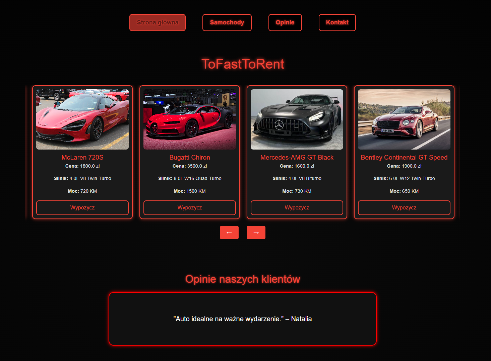
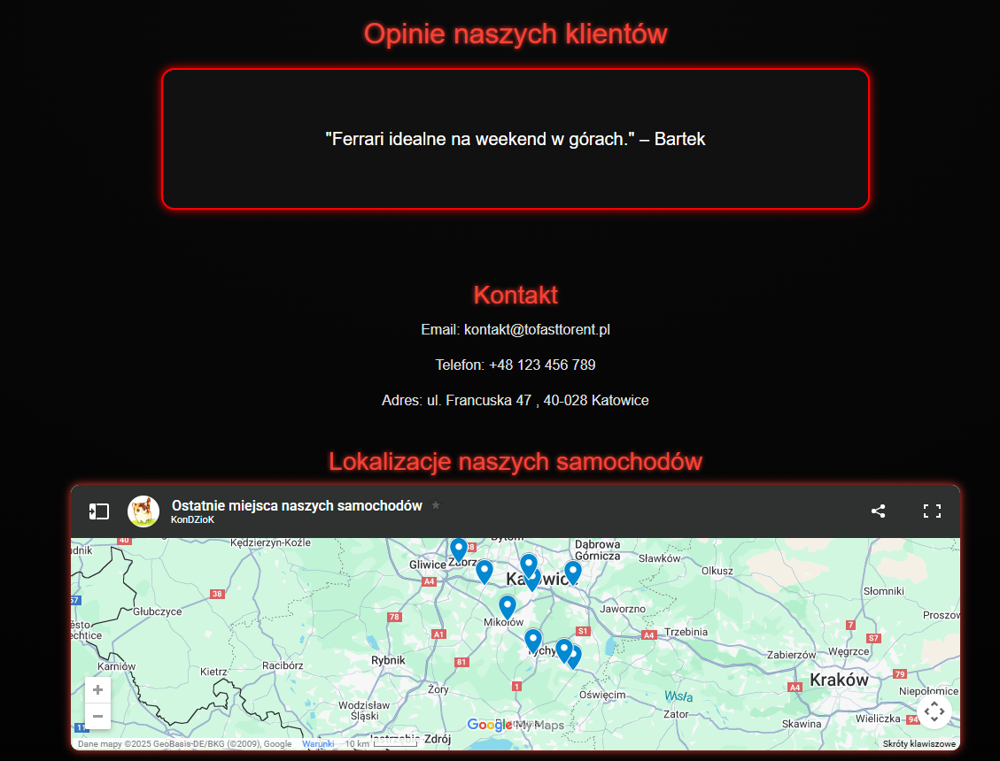
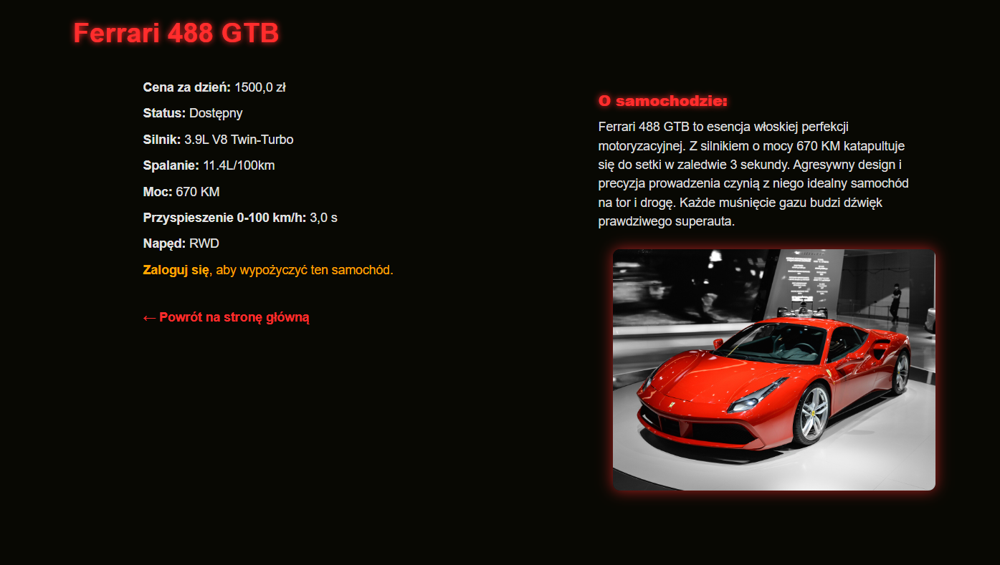

# 🚗 ToFastToRent – Wypożyczalna Samochodów

Projekt ASP.NET Core 8 z Razor Pages do zarządzania wypożyczalnią samochodów. Aplikacja umożliwia przegląd dostępnych pojazdów, filtrowanie, sortowanie i wyszukiwanie modeli oraz dokonywanie rezerwacji. Obsługuje role użytkownika i administratora oraz działa na bazie danych SQLite.

---

## 📑 Spis treści

- [Opis funkcjonalności](#opis-funkcjonalności)
- [Widok Index.cshtml](#widok-indexcshtml)
- [HomeController.cs](#homecontrollercs)
- [Struktura klas](#Struktura-klas)
- [Opis klas](#Opis-klas)
- [Paradygmaty Programowania Obiektowego w HomeController.cs](#Paradygmaty-Programowania-Obiektowego-w-HomeController.cs)
- [Technologie](#technologie)
- [Instalacja](#instalacja)
- [Schemat bazy danych](#schemat-bazy-danych)
- [Możliwości rozwoju](#możliwości-rozwoju)
- [Zdjecia z storny](#Zdjecia-z-strony)
- [Autorzy](#autorzy)

---

## 🧩 Opis funkcjonalności

| Funkcja                         | Opis |
|----------------------------------|------|
| Wyświetlanie pojazdów           | Lista samochodów z bazy danych |
| Karuzela samochodów             | Lista przesuwająca się w obie strony |
| Obliczanie ceny                 | Automatycznie aktualizująca się cena |
| Szczegóły samochodu             | Link „Szczegóły” |
| Warunkowe linki zależnie od roli | Admin może edytować i usuwać, użytkownik rezerwuje |

---

## 🖼 Widok `Index.cshtml`

Widok `Index.cshtml` zawiera:

- Formularz z filtrowaniem po marce i wyszukiwaniem
- Linki do sortowania (`Cena ⬆`, `Cena ⬇`)
- Warunkowe przyciski `Rezerwuj` lub `Edytuj/Usuń` w zależności od roli
- Dane wyświetlane w formie listy `
` z klasą `car-card`

---

## 🧠 `HomeController.cs`

Główna logika kontrolera:

| Metoda                       | Opis                                                                                                                                                                                                                                     |
| ---------------------------- | ---------------------------------------------------------------------------------------------------------------------------------------------------------------------------------------------------------------------------------------- |
| `Index()`                    | Pobiera listę samochodów z bazy danych przy użyciu Entity Framework (`_context.Samochody.ToList()`) i zwraca ją do widoku `Index.cshtml`.                                                                                                |
| `Szczegoly(int id)`          | Ładuje szczegóły samochodu o podanym ID oraz powiązane z nim wypożyczenia. Sprawdza, czy pojazd jest dostępny i czy użytkownik ma uprawnienia do jego przeglądania.                                                                      |
| `PotwierdzWypozyczenie(...)` | Obsługuje formularz rezerwacji. Waliduje dane (pełnoletniość, poprawność formularza), tworzy klienta jeśli nie istnieje, nalicza rabaty (‒10% przy ≥7 dniach, ‒15% przy ≥30 dniach), zapisuje wypożyczenie i aktualizuje status pojazdu. |
| `GenerujFakture(int id)`     | Generuje fakturę PDF z widoku `Faktura.cshtml` za pomocą biblioteki **Rotativa.AspNetCore**. Zwraca plik z nazwą `Faktura_{ID}.pdf`.                                                                                                     |

---

## 🧱 Struktura klas 

    class Samochod {
        +int Id
        +string Marka
        +string Model
        +decimal CenaZaDzien
        +StatusSamochodu Status
        +ICollection~Wypozyczenie~ Wypozyczenia
    }

    class Klient {
        +int Id
        +string Imie
        +string Nazwisko
        +string Email
        +string Telefon
        +ICollection~Wypozyczenie~ Wypozyczenia
    }

    class Wypozyczenie {
        +int Id
        +int CarId
        +int KlientId
        +DateTime DataOd
        +DateTime DataDo
        +decimal CenaCalkowita
        +Samochod Car
        +Klient Klient
    }

    enum StatusSamochodu {
        Dostepny
        Wypozyczony
        Serwis
    }

    Samochod --> "1..*" Wypozyczenie : wypożyczenia
    Klient   --> "1..*" Wypozyczenie : wypożyczenia

## 📦 Opis klas

| Klasa         | Rola               | Opis działania |
|---------------|--------------------|----------------|
| **Samochod**  | Model danych       | - Reprezentuje pojazd w systemie  
- Zawiera: marka, model, cena za dzień  
- Ma status dostępności (`Dostepny`, `Wypozyczony`, `Serwis`)  
- Powiązany z wypożyczeniami (relacja 1:N) |
| **Klient**    | Użytkownik końcowy | - Dane osoby wypożyczającej: imię, nazwisko, email, telefon  
- Jeden klient może mieć wiele wypożyczeń |
| **Wypozyczenie** | Encja operacyjna | - Łączy `Samochod` i `Klient`  
- Przechowuje daty wypożyczenia i koszt  
- Tworzona przy rezerwacji |
| **StatusSamochodu** | Enum | - Definiuje status pojazdu:  
  `Dostepny`, `Wypozyczony`, `Serwis`  
- Używany do filtrowania i weryfikacji uprawnień |

## 👨‍🏫 Paradygmaty Programowania Obiektowego w HomeController.cs
Kod kontrolera HomeController oparty jest na czterech filarach programowania obiektowego (OOP). Poniższa tabela prezentuje każdy z nich wraz z wyjaśnieniem i przykładami z kodu:
| 🧱 Paradygmat     | Opis                                                                                                                                   | Przykład w kodzie                                                                                                                                                                |
| ----------------- | -------------------------------------------------------------------------------------------------------------------------------------- | -------------------------------------------------------------------------------------------------------------------------------------------------------------------------------- |
| **Hermetyzacja**  | Ukrywanie szczegółów implementacji oraz udostępnianie tylko niezbędnych elementów klasy.                                               | Prywatne pole `_context` nie jest dostępne z zewnątrz klasy. Wstrzykiwane przez konstruktor.   `private readonly AppDbContext _context;`                                   |
| **Dziedziczenie** | Klasa dziedziczy po innej klasie i rozszerza jej funkcje.                                                                              | `HomeController` dziedziczy po `Controller`, uzyskując dostęp do metod MVC: `View()`, `RedirectToAction()`, `NotFound()` itd.   `public class HomeController : Controller` |
| **Polimorfizm**   | Zmienna typu bazowego (`IActionResult`) może przyjmować wiele form w czasie działania (np. `ViewResult`, `ForbidResult`, `ViewAsPdf`). | `public IActionResult Index()` `public IActionResult GenerujFakture(...)` `return new ViewAsPdf(...)`                                                                      |
| **Abstrakcja**    | Praca na obiektach domenowych bez znajomości szczegółów implementacji – np. dostęp do bazy danych przez EF Core.                       | `var auta = _context.Samochody.ToList();` `_context.Wypozyczenia.Add(wypozyczenie);` Entity Framework ukrywa SQL pod obiektową składnią LINQ.                              |

## 🔧 Technologie

| Obszar     | Narzędzia |
|------------|-----------|
| Framework  | ASP.NET Core 8.0 |
| UI         | Razor Pages, HTML, CSS |
| ORM        | Entity Framework Core 8 |
| Baza danych | SQLite |
| Inne       | Dependency Injection, RoleManager, Identity, LINQ |

---

## 🚀 Instalacja

git clone https://github.com/WypozyczalniaSamochodowa/JakubBoron_KonradBizacki_Grupa1_WypozyczalniaSamochodowa
- cd CarRentalApp
- dotnet restore
- dotnet run
## 🗄 Schemat bazy danych

W projekcie wykorzystano prosty model danych oparty na SQLite.

### Tabela: `Cars`

| Kolumna       | Typ           | Opis                              |
|---------------|---------------|-----------------------------------|
| Id            | int (PK)      | Unikalny identyfikator pojazdu   |
| Brand         | string        | Marka pojazdu (np. Ford, BMW)    |
| Model         | string        | Model pojazdu (np. Focus, X5)    |
| PricePerDay   | decimal       | Cena za dzień wynajmu            |
| Available     | bool          | Dostępność pojazdu               |

Przy starcie aplikacji baza danych jest inicjalizowana przez `CarService`.

---

## 🔮 Możliwości rozwoju

- ✅ Moduł rezerwacji z wyborem dat (kalendarz)
- ✅ System powiadomień e-mail lub SMS
- 🔄 Wersja mobilna lub responsywny PWA
- 🔄 Integracja z płatnościami online

---

## Zdjecia z strony 
<i>Podgląd strony głównej</i>

<i>Podgląd wyporzyczania samochodu</i>

## 👨‍💻 Autorzy

Projekt wykonany przez:
- Jakub Boroń
- Konrad Bizacki
